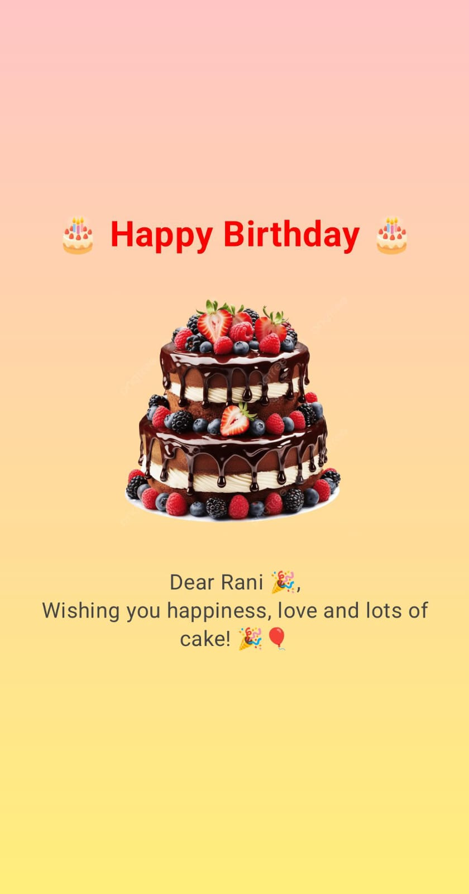

# 🎂 Happy Birthday Card App

A simple and beautiful Android application built using **Kotlin** and **Jetpack Compose**.  
This app displays a digital birthday greeting card with a gradient background, birthday cake image, and a personalized message.

---

## 📸 App Output

  

---

## ✨ Features

- 🎨 Soft vertical gradient background
- 🎂 Birthday cake image
- 🎉 Personalized birthday message
- 📱 Modern UI using Jetpack Compose
- 💡 Clean and beginner-friendly project

---

## 🛠 Tech Stack

- **Kotlin** – 1.9.24
- **Android Gradle Plugin (AGP)** – 8.7.3
- **Jetpack Compose**
- **Material 3**
- **Compose BOM** – 2024.04.01
- **Android Studio**

---

## 🚀 How to Run the Project

1. Clone the repository
2. Open the project in **Android Studio**
3. Sync Gradle files
4. Connect emulator or Android device
5. Click **Run ▶**

---

## 🎨 UI Overview

The app includes:

- A gradient background (Pink → Yellow)
- A bold "Happy Birthday" title
- A rounded birthday cake image
- A personalized birthday wish message

---

## 🎯 Learning Concepts Covered

- Jetpack Compose layouts (Box, Column, Spacer)
- Image loading using `painterResource`
- Gradient background using `Brush`
- Material 3 theming
- Version catalog (`libs.versions.toml`) usage

---

## 📄 License

This project is created for educational and practice purposes.
